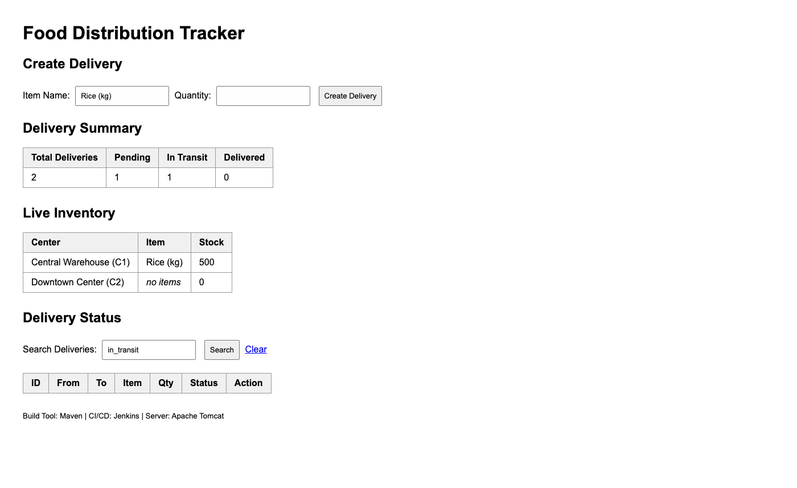

# CI/CD Report — Task 10

Evidence that a broken build cannot reach the live application.

**Project:** Food Distribution Tracker
**Jenkins job:** `Food-Tracker-Pipeline`
**Pipeline:** [`Jenkinsfile`](../Jenkinsfile)
**Branch watched:** `main` (SCM poll every 2 minutes)

---

## 1. Pipeline

```
Checkout → Compile → Unit Test → Package → Deploy to Staging
        → Browser Test → Deploy → Verify
```

### Why the staging context exists

Browser tests need a running application. That rules out the obvious ordering:

- Testing **before** deploy is impossible — there is nothing to test against.
- Testing **after** promoting to the live context means a broken build reaches
  users before anything catches it.

So the new WAR is deployed to a throwaway context
(`food-distribution-tracker-staging`), the browser suite runs against **that**,
and the WAR is only promoted to the live `food-distribution-tracker` context
if every test passes.

```
      new WAR ──→ staging context ──→ 3 browser tests
                                            │
                              all pass ─────┴───── fail
                                  │                    │
                            promote to live      DROP. live stays
                                                  on previous build.
```

### Build parameters

| Parameter | Default | Purpose |
|---|---|---|
| `BRANCH` | `main` | Branch to build |
| `DEPLOY_ENV` | `local` | Target environment label |
| `TOMCAT_WEBAPPS` | `/opt/homebrew/opt/tomcat/libexec/webapps` | Deploy target |
| `APP_CONTEXT` | `food-distribution-tracker` | Live context |
| `STAGING_CONTEXT` | `food-distribution-tracker-staging` | Throwaway test context |
| `APP_PORT` | `8081` | Tomcat port |
| `JAVA_HOME_PATH` | JDK 22 path | JDK used to run Maven |
| `RUN_SELENIUM` | `true` | Whether the browser gate runs |

> **Note on `RUN_SELENIUM`.** Jenkins keeps the *last used* value of an existing
> parameter rather than the `defaultValue` in the `Jenkinsfile`. Changing the
> default to `true` did **not** take effect on the next commit — build #5
> silently skipped the browser stage. It had to be changed in the job
> configuration. This is a real trap in declarative pipelines and is recorded
> here rather than hidden.

---

## 2. Evidence

Four consecutive builds, two deliberately failing.

| Build | Commit | Result | Unit | Browser | Promoted? |
|---|---|---|---|---|---|
| #6 | `4b59b1f` | ✅ SUCCESS | 7/7 | 3/3 | Yes |
| #7 | `675d1dc` | ❌ FAILURE | 7/7 | **1 failure** | **No** |
| #8 | `d219f82` | ❌ FAILURE | 7/7 | **1 error** | **No** |
| #9 | `2704bf6` | ✅ SUCCESS | 7/7 | 3/3 | Yes |

---

## 3. Build #7 — a deliberate defect was caught

### The defect

Commit `675d1dc` removed the status field from the search filter:

```java
// before
String searchText = (d.getId() + " " + d.getItemName() + " " + d.getStatus()).toLowerCase();

// after — status no longer searchable
String searchText = (d.getId() + " " + d.getItemName()).toLowerCase();
```

This is a realistic regression: searching by status silently returns nothing
instead of erroring.

### What the pipeline did

```
Unit Test        Tests run: 7, Failures: 0, Errors: 0     ← unit tests did NOT catch it
Deploy to Staging  staging up after 2 attempts            ← new build deployed for testing
Browser Test     Tests run: 3, Failures: 1, Errors: 0     ← caught it
                   FoodDistributionTrackerSeleniumTest.searchAndFilterDeliveries:174
                   Searching by status should match only the advanced delivery
                   expected:<1> but was:<0>
                   [screenshot] failure captured:
                     target/selenium-screenshots/searchAndFilterDeliveries.png
Deploy           Stage "Deploy" skipped due to earlier failure(s)
Verify           Stage "Verify" skipped due to earlier failure(s)
Finished: FAILURE
```

### Proof nothing reached users

| Check | Result |
|---|---|
| `Deploy` stage | Skipped |
| `Verify` stage | Skipped |
| Live WAR SHA-256 (first 16) | `0ab83db89a32eba8` — unchanged |
| Live WAR mtime | `01:00:40` — still build #6's timestamp |
| Staging context afterwards | `404`, removed by the `cleanup` block |
| Failure screenshot archived | `build-7/archive/target/selenium-screenshots/searchAndFilterDeliveries.png` |



*Copied from the Jenkins build archive into `docs/evidence/`. Captured by the
JUnit `TestWatcher` at the failing assertion; the archive path is quoted in the
build log above.*

**The unit tests passed.** All 7 were green while the application was visibly
broken. Only the browser suite caught it, which is the argument for having it.

---

## 4. Build #8 — the gate failed for the wrong reason

After fixing the defect in `d219f82`, build #8 still failed — not from an
assertion, but an error:

```
org.openqa.selenium.WebDriverException: unknown error: unhandled inspector error:
{"code":-32000,"message":"Node with given id does not belong to the document"}
  at FoodDistributionTrackerSeleniumTest.clickAndWaitForReload
```

Cause: `ExpectedConditions.stalenessOf()` probes the marker element with
`isElementEnabled`, which surfaced Chrome's transient DevTools error as a
`WebDriverException`. `wait.until` propagates it rather than polling again.

This is worth recording because it is the failure mode a release gate must not
have: **a red build that is not caused by the code under test trains people to
ignore red builds.** The fix (`2704bf6`) performs the staleness check directly
and treats both a genuine `StaleElementReferenceException` and the transient
DevTools error as "navigation committed". Any other `WebDriverException` still
propagates, so real failures are not hidden.

The click retry was also narrowed from catching every `RuntimeException` to
catching only that specific error, so an unrelated driver error is no longer
retried away.

Verified with 6 consecutive clean runs before pushing.

---

## 5. Build #9 — corrected and promoted

```
Unit Test        Tests run: 7, Failures: 0, Errors: 0
Deploy to Staging  staging up after 3 attempts
Browser Test     Tests run: 3, Failures: 0, Errors: 0
Deploy           Promoting food-distribution-tracker.war ... (env: local)
Verify           Checking deployed application at http://localhost:8081/...
Finished: SUCCESS
```

Live WAR mtime advanced `01:00:40 → 01:10:43`, confirming the corrected build
was promoted.

---

## 6. What each requirement produced

| Requirement | Evidence |
|---|---|
| Pipeline runs on every commit | Builds #3–#9, all triggered by SCM change with no manual action |
| Selenium runs through Maven | `mvn test -Pselenium` in the `Browser Test` stage |
| Test results published | `junit` step publishes 7 unit + 3 browser results per build |
| Screenshots on failure | Build #7 archive; mechanism verified independently by breaking an assertion locally |
| Failed tests stop deployment | Builds #7 and #8: `Deploy` and `Verify` skipped, live WAR byte-identical |
| Deliberate defect introduced and corrected | `675d1dc` → caught → `d219f82` → green in #9 |

---

## 7. Test flake work

Four defects were found by testing that review had not. Three were in the test
code itself.

| # | Defect | Found by | Fix |
|---|---|---|---|
| 1 | Search could not match on status | Manual use | Restored; later reintroduced deliberately to prove the gate |
| 2 | Assertions ran against the page about to be replaced, causing intermittent failures across runs | Local suite | Wait for the old document to be discarded before asserting |
| 3 | Transient Chrome error failed the build | Build #8 | Treat as navigation committed; other errors still propagate |
| 4 | Fixed `sleep 8` shorter than Tomcat's real ~12s deploy | Jenkins | Poll the staging URL for readiness |

Row 2 is the important one. The suite failed 1-in-3 runs in three *different*
ways before the cause was identified: asserting on an element that is present on
every page, asserting on a search term that had just been typed, and asserting
on a status message that already contained the awaited text. All three returned
from the wait immediately and let the assertion read the outgoing page. Adding a
retry would have hidden this rather than fixed it.

Full detail in [`selenium-test-plan.md`](selenium-test-plan.md).

---

## 8. Limitations of this gate

| Limitation | Consequence |
|---|---|
| Tests run against staging, so a regression that only manifests in the *already deployed* version is caught by the next build, not this one. | The gate is strong for new code, weaker for the running artifact. |
| The gate is per-push. Two pushes in quick succession could each build against a different staging deploy. | No concurrency group is configured. |
| Jenkins runs on one machine with session-scoped Tomcat state. | Not a demonstration of scale. |
| `RUN_SELENIUM` can be turned off, and a build with it off deploys untested. | Mitigation: leave it `true`. Nothing prevents a deliberate override. |
| The staging context name is a parameter. Two builds sharing a staging context would interfere. | Not an issue at this concurrency level. |
